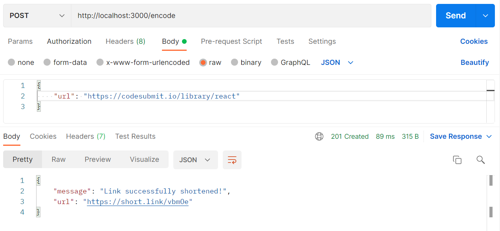
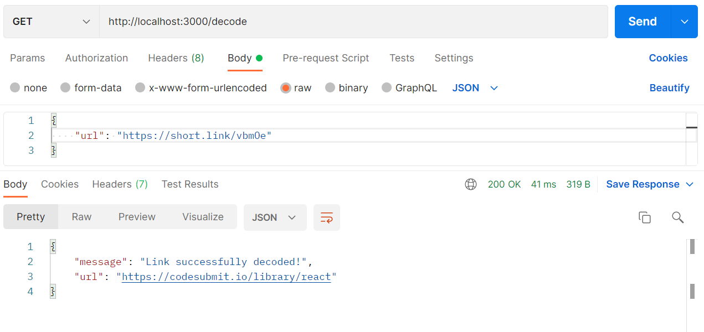

### The Shortest Url
URL shortening service developed using Node.js and Express.js.

### Before Running
There are a few things that have to be installed in the machine for the project to run correctly:
- [Node.js and npm](https://docs.npmjs.com/downloading-and-installing-node-js-and-npm)
- [MySQL](https://dev.mysql.com/doc/mysql-getting-started/en/)

Once MySQL is installed, make sure to create a new database in the MySQL console with the command:
```
create database the_shortest_url;
```

### Running The Project
After cloning the project with `git clone https://github.com/leoruas/the-shortest-url.git`, navigate to the cloned folder with:
```
cd the-shortest-url
```

Now that you're in the folder, install the project's 
dependencies with:
```
npm install
```

Once the installation is finished, update the environment variables in the **.env** file located in the root of the project. Default values are:
```
MYSQL_USER=root
MYSQL_PASSWORD=
MYSQL_DATABASE=the_shortest_url
MYSQL_HOST=localhost
MYSQL_PORT=3306
```

The project can now be executed with the command:
```
npm start
```
After running the execute command, you should see a message on the terminal saying: `Server running on port 3000`

### Encode Route
The encode route is the POST request responsible for receiving the original url, storing it in the database and encoding it. This route requires a JSON on the body of the request with the following format:
```
{
  url: "https://codesubmit.io/library/react"
}
```
Once you send the url, the API will return a shortened version of it as seen in the following image:


### Decode Route
The decode route is the GET request responsible for receiving the shortened link, decoding it and searching the database for the original link. This route requires a JSON on the body of the request with the following format:
```
{
  url: "https://short.link/HsUba"
}
```
Once you send the url, the API will return the original version of it as seen in the following image:
